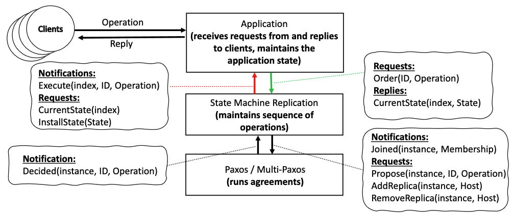

# Project Phase 2 <!-- omit in toc -->

## Project generation link <!-- omit in toc -->

Use the following link to generate this project repository for your group

**<https://classroom.github.com/a/PetG1iuo>**

## Table of contents <!-- omit in toc -->

- [Organisational details](#organisational-details)
- [Overall goals](#overall-goals)
  - [Implementation](#implementation)
  - [Report](#report)
- [Architectural overview](#architectural-overview)
  - [State Machine Replication](#state-machine-replication)
  - [Agreement Protocol](#agreement-protocol)
  - [Application](#application)
  - [Clients (YCSB)](#clients-ycsb)
- [Experimental Analysis](#experimental-analysis)
- [Evaluation criteria](#evaluation-criteria)
- [Project submission](#project-submission)
- [Commands](#commands)
  - [Compile](#compile)
  - [Run replicas](#run-replicas)
  - [Run YCSB clients](#run-ycsb-clients)

## Organisational details

- **Same groups** as defined in phase 1 of the project.
- **Deadline: 23:59:59 2023-11-29 (Quarta-feira)**
- Cluster access is provided for trialling your system.

## Overall goals

### Implementation

The project focuses on the study and implementation of a distributed system for managing the state of a Hash map. The Hash map will be managed by a State Machine Replication (SMR) algorithm that manages the overall state and membership of the system. The SMR algorithm will use an underlying agreement protocol to decide consensus on the ordering of operations. 

Your system should implement the SMR algorithm, as well as two different agreement protocols, based on [Paxos](https://lamport.azurewebsites.net/pubs/paxos-simple.pdf) **and** [ABD Quorum](https://groups.csail.mit.edu/tds/papers/Attiya/TM-423.pdf) (see also [Lab 05](https://github.com/MEI-ASD-2023/lab05-abd-quorum)). The ABD Quorum agreement protocol can be implemented using a flood broadcast system (e.g. in the same way as the distributed system that you implemented in Phase 01 of the project), though you can also experiment with other broadcast types. To this end, the goals/steps of this first phase of the project are defined as follows:

1. Implement a SMR algorithm, that is agnostic to the choice of agreement protocol.
2. Implement Paxos-based agreement.
3. Implement ABD Quorum-based agreement (you may find that you can adapt your code in phase 01 of the project to do this).
4. Conduct experimental analysis using 3 nodes, and using [YCSB-based](https://github.com/brianfrankcooper/YCSB) clients to compare the system using both agreement protocols, comparing throughput and latency, as observed by clients.

The solution for your project should be developed in the `src/asd-project2-base` folder provided.

### Report

Write a report, using the [latex template](./latex) provided, that details the following information.

1. The design and implementation of your system
2. A performance analysis of your system, comparing your system using both agreement protocols.

The report must have a maximum of 8 pages, including figures and tables, but excluding bibliography.

## Architectural overview



The diagram above details the mandatory structure for your distributed system, including the **interfaces** that must be handled. The Java project contained in the `src/` folder already provides the Babel events that are used to instantiate these interfaces.

Every protocol that you will implement should have an equivalent interface to communicate with the other local protocols (this is instantiated by Requests and Indications). This should allow you to swap one agreement protocol implementation for another while your process still executes correctly. Notice that the messages exchanged by each protocol that you develop with the (equivalent) protocol on other processes is not fixed. You should model these messages following the specification of the protocol that you are implementing. Notice that if you careful in your implementation the State Machine Replication protocol could be fully agnostic to the underlying agreement protocol (either Paxos or ABD Quorum).

### State Machine Replication

This protocol is responsible for receiving the (client) operations from the application, and replicate them through the agreement protocol (i.e., Paxos or ABD Quorum). It is the state machine that keeps track of which operation has been decided for each position of the sequence of commands of the state machine and notifies the application to execute these operations (in the appropriate order).

The protocol is also responsible for managing the communication channel (i.e., open TCP connections), manage the membership of the system, which includes requesting to be added to the replica set when a new replica joins the system, and inform the agreement protocol of modifications in the membership. This implies that the state machine replication protocol is responsible also for detecting failures of replicas, attempting to re-establish connections with them a (configurable) number of times, and when suspecting that a replica having failed, issue an operation for the state machine to remove that replica.

When joining a replica set, it is necessary to copy the current state of the system when the new replica is added. This process, usually named *state transfer* is handled by the state machine replication protocol, that can request a copy of the current application state to the application, and upon receiving it, can send that state (and the information concerning the current position of the sequence of commands in which the replica was added) to the newly joining replica. To avoid all existing replicas to do this, one way you can address this is by having the replica that received the request of the new replica to be added to the system replying to the new replica with this information (notice that the State Machine Replication protocol needs to exchange messages through the network with other processes).

Your implementation of this protocol should be, as much as possible, independent of the underlying agreement protocol, although you might need to pass an additional parameter to the state machine to inform of the protocol being used for agreement.In both cases, whenever a new instance of the protocol is initialized (i.e., for each of the positions of the sequence of operations managed by the state machine) it might be required that the state machine protocol provides to the protocol the membership of the system.

### Agreement Protocol

You will implement the two different variants of agreement protocol in this project: Paxos and ABD Quorum. In your implementation avoid optimisations, such as running multiple instances at the same time (as this requires a significant engineering effort to implement correctly).

Paxos does not have a leader, and every process will propose commands to be decided across the different instances. You can decide what to do when a Paxos protocol receives a message for an instance that it has not yet started (i.e., where it has not received a proposal): you can reply following the protocol specification, or you can store the message locally and wait for the local state machine protocol to propose a value for that instance, and only after that process the message. Notice that you need to be aware of membership changes to be able to compute how many processes are a majority. The best suggestion for implementing Paxos, since you will need multiple instances, is to store the state of the Paxos algorithm within a Java class, and store multiple instances of this class in a map, where the key is the instance number. As such when you receive a message for a particular instance, you can fetch the current state of that instance in your map, and process the message by only modifying the state of Paxos for that instance. All Paxos messages have to be tagged with the instance for which they refer (instances can be a monotonic integer).

For the ABD Quorum implementation, you can use the same broadcast protocol as defined in phase 01 of the project (e.g. based on flood, or something more complex). Recall that the application you used generated random messages, you will need to modify the format of messages expected to provide additional structure. Again, you have choices that you can make regarding the way that messages are queued, and these are similar to those that are present in the Paxos implementation that you will write.

Notice that in both protocols, a process should not participate in instances that occur when the replica is not part of the system (i.e., before being added to the system or after being removed from the system).

### Application

The application layer is provided to you already. It will have the code necessary to support all interactions to clients, and it will use the prescribed interface to interact with the state machine replication layer.

The application can also expose its internal state (in a serialized form) and install a copy of state gathered from another replica. This is relevant to allow a new replica of the application to be added to the system, while the system is operating.

### Clients (YCSB)

To inject load in the system (i.e., execute operations) we are going to use the popular [YCSB system](https://github.com/brianfrankcooper/YCSB). We will provide a driver that allows YCSB to interact with the replicated application described above. Note that YCSB might send operations to any of the active replicas. Also, YCSB executes multiple ``client threads'', where each one emulates an individual client. This is important, because in the experiments we will want to study the differences between the latency (measured in milliseconds) and throughput (measured in operations per second) as the total number of clients in the system increases. YCSB already computes and outputs both of these metrics for you.

You might need to run more than one instance of YCSB such that you can distribute the load of clients across multiple machines. A single physical machine has limits on the number of client threads it can execute concurrently, without the clients becoming bottlenecked. The evaluation should saturate the servers and not the clients, as that would yield incorrect experimental results. If you rely on multiple instances of YCSB to run your experiments, you will need to (manually) combine the results outputted by each instance. To that end, you should compute the average of the latency observed on each instance, and you should compute the sum of the throughput reported by each YCSB instance.

## Experimental Analysis

You will conduct experiments to access the latency and throughput of the solutions that you have implemented. To do that you will vary the total number of clients (threads across YCSB processes) issuing operations over the system. Since in your system read operations are being treated in the same way as write operations (i.e., they are ordered in the state machine), the workload can use any distribution of write and read operations. For simplicity and uniformity, you can use 50%W 50%R.
When executing different number of clients interacting with your replicated system (that will be composed of 3 replicas), YCSB will report both the latency of client operations and throughput (i.e., operations per second). The idea is that you plot the in a graph, where the x-axis reports the throughput of the system, and on the y-axis you report the latency. In your experiments, be careful to avoid saturating the clients, if you need to run more client threads than a single machine can handle you can run multiple YCSB instances across different machines simultaneously. If you do this, remember that the throughput from YCSB should be summed across all instances that are running, and the latency should be averaged. 

In the plot you represent, for each system, the data point for each experiment, and you increase the number of clients and connect these sequentially with a line.

## Evaluation criteria

The project delivery includes both the code and a written report that should have the format of a short paper. The report must contain clear and readable pseudocode for each of the implemented protocols, alongside a description of the intuition of these protocols. A correctness argument for protocol that was devised or adapted by students will be positively considered in grading the project. The written report should also provide information about all experimental work conducted by the students to evaluate their solution in practice (i.e., description of experiments, setup, parameters) as well as the results and a discussion of those results.

- The project will be evaluated by the correctness of the implemented solutions, its efficiency, and the quality of the implementations (in terms of code readability).
- The quality and clearness of the report of the project will have an impact the final grade. Students with a poorly written report run the risk of penalisation, based on the evaluation of the correctness the solutions employed.
- This phase of the project will be graded in a scale from 1 to 20.

## Project submission

The code and report that you submit should be pushed to this repository. You will then submit the **link to your repository** and the **commit ID** corresponding to the version of the project that you would like to have evaluated to a Google Form, which will be provided at a later date. The deadline for the project is **23:59:59 2023-11-29 (Quarta-feira)**.

## Commands

### Compile

```bash
cd src/asd-project2-base
mvn compile package
```

### Run replicas

You can use the `start-processes-local.sh` script file to start multiple client processes. For example, the following command starts 3 replicas with p2p ports 34000-34002, and server ports 35000-35002.

```bash
cd src/asd-project2-base
bash start-processes-local.sh 3
```

You can also start a process manually by running the following command, where you must modify `config.properties` or use flags to indicate the ports/network interfaces that you would like to use.

```bash
java -cp target/asdProj2.jar Main
```

### Run YCSB clients

Once you have a system of processes running, you can use the following command to run an instance of YCSB.

```bash
cd src/asd-project2-base/client
bash exec.sh <number_of_processes> <size_of_hash_map_values> <comma_separated_ip_addresses_and_ports> <proportion_of_reads> <proportion_of_writes>
```

For instance, to start YCSB for a system with:

- 3 replicas
- 1024 bytes for hash map values
- 0% read
- 100% write

you can use the following command:

```bash
./exec.sh 3 1024 127.0.0.1:35000,127.0.0.1:35001,127.0.0.1:35002 0 100
```
